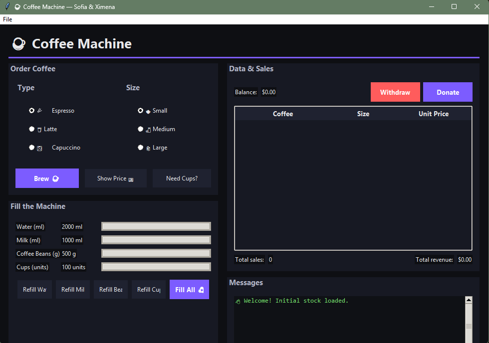

# CoffeeMachine
[![Contributors][contributors-shield]][contributors-url]
[![Commits][commits-shield]][commits-url]

*Assignment for the course Programming for Data Mining*

This project simulates the functionality of a coffee machine, allowing users to interact with it through a Python-based program.


<div align="right">

### Built with
[](https://www.python.org/)
[](#)

</div>

<br>

## GUI preview



## Prerequisites:
1. Python installed (verify)
      ```sh
   python --version
   ```

## Usage:
1. Clone the repository
    ```sh
   git clone https://github.com/xisaach03/CoffeeMachine.git
   ```
2. Navigate into the project directory
      ```sh
   cd CoffeeMachine
   ```
3. Open a terminal in the project folder:
      ```sh
      cd path\to\CoffeeMachine
      ```
4. Run the program:
      ```sh
      python main.py
      ```

## Project Structure
    
  ```sh
      CoffeeMachine/
      ├─ main.py           # GUI and main program logic
      ├─ coffeeprep.py     # Coffee and StockIngredients classes
      └─ README.md         # Documentation
  ```
      
<br>

## Additional Documents:

<div align="center">
  <table border="0">
    <tr>
      <td align="center" width="200px">
        <b>.xlsx</b> for activity planning<br>
        <a href="https://iteso01-my.sharepoint.com/:x:/g/personal/ximena_isaac_iteso_mx/ETMmDvcbzeZHqQav5zfASLgBZ5GO3FFAQJDqHpbSD4MIkg?e=hDRpMU">
          
        </a>
      </td>
      <td align="center" width="200px">
        <b>.docx</b> WorkSpace<br>
        <a href="https://iteso01-my.sharepoint.com/:w:/g/personal/ximena_isaac_iteso_mx/EZeI3eNw_S9Kj6F8iolqbDQBwjFXhyAbKq7BBl4g5R9SdQ?e=eYEpnB">
        
        </a>
      </td>
      <td align="center" width="200px">
        <b>.pdf</b> with requirements<br>
        <a href="https://iteso01-my.sharepoint.com/:b:/g/personal/ximena_isaac_iteso_mx/EQBTUZwinL9MoxXs4lS7CFMBSTITwAkYBOTayBcMAdf1dQ?e=742PZC">
          
        </a>
      </td>
    </tr>
  </table>
</div>


[contributors-shield]: https://img.shields.io/github/contributors/xisaach03/CoffeeMachine.svg?style=for-the-badge
[contributors-url]: https://github.com/xisaach03/CoffeeMachine/graphs/contributors
[commits-shield]: https://img.shields.io/github/commit-activity/m/xisaach03/CoffeeMachine?style=for-the-badge
[commits-url]: https://github.com/xisaach03/CoffeeMachine/graphs/commit-activity
